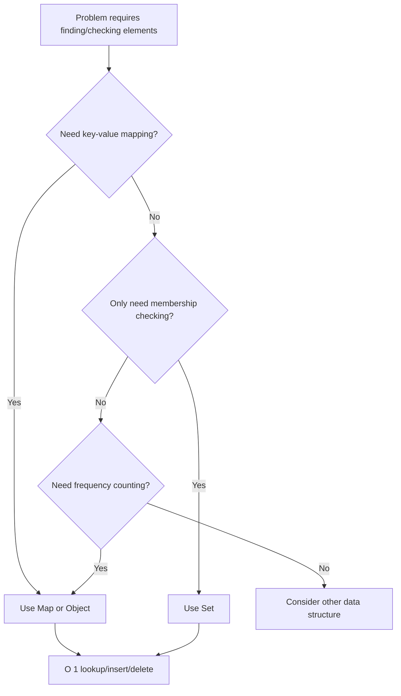

# Hash Lookup Technique

## Table of Contents

- [Overview](#overview)
- [When to Use](#when-to-use)
- [Core Data Structures](#core-data-structures)
- [Hash Map (Map/Object) Patterns](#hash-map-mapobject-patterns)
- [Hash Set Patterns](#hash-set-patterns)
- [Advanced Patterns](#advanced-patterns)
- [Time and Space Complexity](#time-and-space-complexity)
- [Common Pitfalls](#common-pitfalls)
- [Additional Resources](#additional-resources)

## Overview

The **Hash Lookup** technique leverages hash-based data structures (Maps, Sets, Objects) to achieve **O(1) average-case** lookups, insertions, and deletions. This transforms problems that would require O(n) or O(n²) time with linear search into much more efficient solutions.

Hash tables use a hash function to compute an index into an array of buckets, where the desired value can be found. In JavaScript/TypeScript, we primarily use:

- **Map**: Key-value pairs with any data type as keys
- **Set**: Unique values collection
- **Object**: Key-value pairs with string/symbol keys (legacy approach)

### Key Concept

Instead of iterating through data structures to find elements, check membership, or count frequencies, we use hash tables to:

1. **Store** elements or mappings with O(1) insertion
2. **Retrieve** values or check existence with O(1) lookup
3. **Update** frequencies or values with O(1) access
4. **Delete** elements with O(1) removal



## When to Use

The hash lookup technique is ideal when you need to:

- ✅ Find pairs/complements that sum to a target (Two Sum pattern)
- ✅ Count frequencies of elements (character/number counting)
- ✅ Check for duplicates or unique elements
- ✅ Find first non-repeating or unique occurrence
- ✅ Group elements by a common property
- ✅ Cache/memoize computed results
- ✅ Track visited nodes in graphs/trees
- ✅ Check if elements exist in a collection efficiently
- ✅ Map between different representations (indices, values, etc.)

**Common Problem Keywords:**

- "find pair that sums to"
- "check if contains duplicate"
- "count frequencies"
- "group by"
- "first unique/non-repeating"
- "two sum" variations
- "anagram" detection
- "intersection" or "union"
- "cache" or "memoize"

**Key Indicators:**

- Need faster than O(n) search in unsorted data
- Checking membership multiple times
- Counting occurrences or frequencies
- Finding complements or pairs efficiently
- Avoiding nested loops for lookups

## Core Data Structures

### Map (ES6 Map)

**Features:**

- Key-value pairs with any data type as keys
- Maintains insertion order
- Built-in size property
- Iterates in insertion order
- Better performance for frequent additions/deletions

```javascript
const map = new Map();

// Basic operations - all O(1)
map.set(key, value); // Add/update
const val = map.get(key); // Retrieve
const exists = map.has(key); // Check existence
map.delete(key); // Remove
map.clear(); // Remove all
const size = map.size; // Get count

// Iteration
for (const [key, value] of map) {
  console.log(key, value);
}

// Common patterns
map.set(key, (map.get(key) || 0) + 1); // Increment frequency
map.set(key, (map.get(key) || []).concat(value)); // Group values
```

### Set (ES6 Set)

**Features:**

- Stores unique values only
- Any data type can be stored
- Maintains insertion order
- Fast membership testing

```javascript
const set = new Set();

// Basic operations - all O(1)
set.add(value); // Add
const exists = set.has(value); // Check existence
set.delete(value); // Remove
set.clear(); // Remove all
const size = set.size; // Get count

// Iteration
for (const value of set) {
  console.log(value);
}

// Set operations
const intersection = new Set([...setA].filter((x) => setB.has(x)));
const union = new Set([...setA, ...setB]);
const difference = new Set([...setA].filter((x) => !setB.has(x)));
```

### Object (Legacy)

**Features:**

- String or Symbol keys only
- Prototype chain considerations
- Good for simple string key mappings

```javascript
const obj = {};

// Basic operations
obj[key] = value; // Add/update
const val = obj[key]; // Retrieve
const exists = key in obj; // Check existence (includes prototype)
const exists2 = obj.hasOwnProperty(key); // Own property only
delete obj[key]; // Remove

// Better alternative: Object.create(null) to avoid prototype
const cleanObj = Object.create(null);
```

**When to use each:**

- **Map**: When keys are non-strings, need insertion order, or frequent add/delete
- **Set**: When only checking membership, need unique values
- **Object**: Simple string key lookups, legacy code, or JSON-like structures

## Hash Map (Map/Object) Patterns

### Pattern 1: Two Sum (Complement Pattern)

Find pairs that sum to a target using complement lookup.

```javascript
/**
 * Find indices of two numbers that add up to target
 * @param {number[]} nums - Array of integers
 * @param {number} target - Target sum
 * @return {number[]} Indices of the two numbers
 */
const twoSum = (nums, target) => {
  const map = new Map(); // value -> index

  for (let i = 0; i < nums.length; i++) {
    const complement = target - nums[i];

    // Check if complement exists in map
    if (map.has(complement)) {
      return [map.get(complement), i];
    }

    // Store current number and its index
    map.set(nums[i], i);
  }

  return [];
};

// Example usage:
console.log(twoSum([2, 7, 11, 15], 9)); // Output: [0, 1]
console.log(twoSum([3, 2, 4], 6)); // Output: [1, 2]
console.log(twoSum([3, 3], 6)); // Output: [0, 1]
```

**Time:** O(n) - single pass through array  
**Space:** O(n) - worst case, store all elements in map

**How It Works:**

1. For each number, calculate its complement (target - number)
2. Check if complement already exists in map (O(1) lookup)
3. If yes, we found our pair; if no, store current number
4. This avoids the O(n²) nested loop approach

### Pattern 2: Frequency Counter

Count occurrences of elements efficiently.

```javascript
/**
 * Find first non-repeating character in string
 * @param {string} s - Input string
 * @return {number} Index of first non-repeating character, or -1
 */
const firstUniqChar = (s) => {
  const freq = new Map();

  // Count frequencies
  for (const char of s) {
    freq.set(char, (freq.get(char) || 0) + 1);
  }

  // Find first character with frequency 1
  for (let i = 0; i < s.length; i++) {
    if (freq.get(s[i]) === 1) {
      return i;
    }
  }

  return -1;
};

// Example usage:
console.log(firstUniqChar('leetcode')); // Output: 0 ('l')
console.log(firstUniqChar('loveleetcode')); // Output: 2 ('v')
console.log(firstUniqChar('aabb')); // Output: -1
```

**Alternative with Object:**

```javascript
const firstUniqChar = (s) => {
  const freq = {};

  for (const char of s) {
    freq[char] = (freq[char] || 0) + 1;
  }

  for (let i = 0; i < s.length; i++) {
    if (freq[s[i]] === 1) {
      return i;
    }
  }

  return -1;
};
```

### Pattern 3: Grouping/Categorization

Group elements by a common property or computed key.

```javascript
/**
 * Group anagrams together
 * @param {string[]} strs - Array of strings
 * @return {string[][]} Grouped anagrams
 */
const groupAnagrams = (strs) => {
  const map = new Map();

  for (const str of strs) {
    // Sort characters to create unique key for anagrams
    const key = str.split('').sort().join('');

    // Group strings with same sorted key
    if (!map.has(key)) {
      map.set(key, []);
    }
    map.get(key).push(str);
  }

  return Array.from(map.values());
};

// Example usage:
console.log(groupAnagrams(['eat', 'tea', 'tan', 'ate', 'nat', 'bat']));
// Output: [["eat","tea","ate"], ["tan","nat"], ["bat"]]
```

**Alternative with character count key (more efficient):**

```javascript
const groupAnagrams = (strs) => {
  const map = new Map();

  for (const str of strs) {
    // Create key from character counts
    const count = new Array(26).fill(0);
    for (const char of str) {
      count[char.charCodeAt(0) - 'a'.charCodeAt(0)]++;
    }
    const key = count.join('#');

    if (!map.has(key)) {
      map.set(key, []);
    }
    map.get(key).push(str);
  }

  return Array.from(map.values());
};
```

### Pattern 4: Index Mapping

Map values to indices for quick lookup.

```javascript
/**
 * Check if array contains duplicate within k indices of each other
 * @param {number[]} nums - Array of integers
 * @param {number} k - Maximum distance
 * @return {boolean} True if duplicate within k distance exists
 */
const containsNearbyDuplicate = (nums, k) => {
  const indexMap = new Map(); // value -> most recent index

  for (let i = 0; i < nums.length; i++) {
    if (indexMap.has(nums[i])) {
      const prevIndex = indexMap.get(nums[i]);
      if (i - prevIndex <= k) {
        return true;
      }
    }
    indexMap.set(nums[i], i);
  }

  return false;
};

// Example usage:
console.log(containsNearbyDuplicate([1, 2, 3, 1], 3)); // Output: true
console.log(containsNearbyDuplicate([1, 0, 1, 1], 1)); // Output: true
console.log(containsNearbyDuplicate([1, 2, 3, 1, 2, 3], 2)); // Output: false
```

### Pattern 5: Running Prefix/Cumulative Sum

Track cumulative sums with hash map for subarray problems.

```javascript
/**
 * Count number of subarrays that sum to k
 * @param {number[]} nums - Array of integers
 * @param {number} k - Target sum
 * @return {number} Count of subarrays
 */
const subarraySum = (nums, k) => {
  const prefixSumCount = new Map([[0, 1]]); // sum -> count
  let currentSum = 0;
  let count = 0;

  for (const num of nums) {
    currentSum += num;

    // Check if (currentSum - k) exists
    // This means there's a subarray ending at current index with sum k
    const complement = currentSum - k;
    if (prefixSumCount.has(complement)) {
      count += prefixSumCount.get(complement);
    }

    // Add current sum to map
    prefixSumCount.set(currentSum, (prefixSumCount.get(currentSum) || 0) + 1);
  }

  return count;
};

// Example usage:
console.log(subarraySum([1, 1, 1], 2)); // Output: 2 ([1,1], [1,1])
console.log(subarraySum([1, 2, 3], 3)); // Output: 2 ([1,2], [3])
console.log(subarraySum([1, -1, 1, 1, 1], 3)); // Output: 3
```

## Hash Set Patterns

### Pattern 1: Duplicate Detection

Check for duplicates in O(n) time.

```javascript
/**
 * Check if array contains any duplicates
 * @param {number[]} nums - Array of integers
 * @return {boolean} True if any value appears at least twice
 */
const containsDuplicate = (nums) => {
  const seen = new Set();

  for (const num of nums) {
    if (seen.has(num)) {
      return true;
    }
    seen.add(num);
  }

  return false;
};

// One-liner alternative
const containsDuplicateShort = (nums) => {
  return new Set(nums).size !== nums.length;
};

// Example usage:
console.log(containsDuplicate([1, 2, 3, 1])); // Output: true
console.log(containsDuplicate([1, 2, 3, 4])); // Output: false
console.log(containsDuplicate([1, 1, 1, 3, 3, 4, 3, 2, 4, 2])); // Output: true
```

### Pattern 2: Longest Sequence/Chain

Find longest consecutive sequence using set for O(1) lookups.

```javascript
/**
 * Find length of longest consecutive elements sequence
 * @param {number[]} nums - Unsorted array of integers
 * @return {number} Length of longest consecutive sequence
 */
const longestConsecutive = (nums) => {
  const numSet = new Set(nums);
  let maxLength = 0;

  for (const num of numSet) {
    // Only start counting if num is start of a sequence
    // (i.e., num-1 doesn't exist)
    if (!numSet.has(num - 1)) {
      let currentNum = num;
      let currentLength = 1;

      // Count consecutive numbers
      while (numSet.has(currentNum + 1)) {
        currentNum++;
        currentLength++;
      }

      maxLength = Math.max(maxLength, currentLength);
    }
  }

  return maxLength;
};

// Example usage:
console.log(longestConsecutive([100, 4, 200, 1, 3, 2])); // Output: 4 ([1,2,3,4])
console.log(longestConsecutive([0, 3, 7, 2, 5, 8, 4, 6, 0, 1])); // Output: 9
```

**Time:** O(n) - each number visited at most twice  
**Space:** O(n) - storing all numbers in set

### Pattern 3: Set Operations

Intersection, union, difference using sets.

```javascript
/**
 * Find intersection of two arrays (unique elements)
 * @param {number[]} nums1 - First array
 * @param {number[]} nums2 - Second array
 * @return {number[]} Intersection of both arrays
 */
const intersection = (nums1, nums2) => {
  const set1 = new Set(nums1);
  const set2 = new Set(nums2);

  return [...set1].filter((num) => set2.has(num));
};

// Alternative: using Set constructor with filter
const intersectionAlt = (nums1, nums2) => {
  const set2 = new Set(nums2);
  return [...new Set(nums1.filter((num) => set2.has(num)))];
};

// Example usage:
console.log(intersection([1, 2, 2, 1], [2, 2])); // Output: [2]
console.log(intersection([4, 9, 5], [9, 4, 9, 8, 4])); // Output: [4, 9] or [9, 4]
```

**Set Union:**

```javascript
const union = (nums1, nums2) => {
  return [...new Set([...nums1, ...nums2])];
};
```

**Set Difference:**

```javascript
const difference = (nums1, nums2) => {
  const set2 = new Set(nums2);
  return [...new Set(nums1)].filter((num) => !set2.has(num));
};
```

### Pattern 4: Visited/Seen Tracking

Track visited nodes in graph/tree traversal.

```javascript
/**
 * Determine if path exists from source to destination in graph
 * @param {number} n - Number of vertices
 * @param {number[][]} edges - Edge list
 * @param {number} source - Starting vertex
 * @param {number} destination - Target vertex
 * @return {boolean} True if path exists
 */
const validPath = (n, edges, source, destination) => {
  // Build adjacency list
  const graph = new Map();
  for (let i = 0; i < n; i++) {
    graph.set(i, []);
  }
  for (const [u, v] of edges) {
    graph.get(u).push(v);
    graph.get(v).push(u);
  }

  const visited = new Set();
  const queue = [source];
  visited.add(source);

  while (queue.length > 0) {
    const node = queue.shift();

    if (node === destination) {
      return true;
    }

    for (const neighbor of graph.get(node)) {
      if (!visited.has(neighbor)) {
        visited.add(neighbor);
        queue.push(neighbor);
      }
    }
  }

  return false;
};
```

## Advanced Patterns

### Pattern 1: Multi-level Hashing

Use nested maps for complex grouping.

```javascript
/**
 * Group people by age and city
 * @param {Object[]} people - Array of person objects
 * @return {Map<number, Map<string, Object[]>>} Nested grouping
 */
const groupPeople = (people) => {
  const groups = new Map(); // age -> Map(city -> people[])

  for (const person of people) {
    if (!groups.has(person.age)) {
      groups.set(person.age, new Map());
    }

    const cityMap = groups.get(person.age);
    if (!cityMap.has(person.city)) {
      cityMap.set(person.city, []);
    }

    cityMap.get(person.city).push(person);
  }

  return groups;
};
```

### Pattern 2: Hash Map with Expiry/Time Window

Sliding window with hash map for time-based problems.

```javascript
/**
 * Design logger that rate-limits messages
 */
class Logger {
  constructor() {
    this.messageTime = new Map(); // message -> timestamp
  }

  /**
   * Returns true if message should be printed, false if rate-limited
   * @param {number} timestamp - Current timestamp
   * @param {string} message - Message to log
   * @return {boolean}
   */
  shouldPrintMessage(timestamp, message) {
    if (!this.messageTime.has(message)) {
      this.messageTime.set(message, timestamp);
      return true;
    }

    const lastTime = this.messageTime.get(message);
    if (timestamp - lastTime >= 10) {
      this.messageTime.set(message, timestamp);
      return true;
    }

    return false;
  }
}

// Example usage:
const logger = new Logger();
console.log(logger.shouldPrintMessage(1, 'foo')); // Output: true
console.log(logger.shouldPrintMessage(2, 'bar')); // Output: true
console.log(logger.shouldPrintMessage(3, 'foo')); // Output: false (within 10 sec)
console.log(logger.shouldPrintMessage(11, 'foo')); // Output: true (after 10 sec)
```

### Pattern 3: Bidirectional Mapping

Map both directions for O(1) lookup in both ways.

```javascript
/**
 * Design data structure that supports insert, delete, and random access
 */
class RandomizedSet {
  constructor() {
    this.map = new Map(); // value -> index in array
    this.values = []; // array of values
  }

  /**
   * Insert value into set
   * @param {number} val
   * @return {boolean} True if value didn't exist
   */
  insert(val) {
    if (this.map.has(val)) {
      return false;
    }

    this.map.set(val, this.values.length);
    this.values.push(val);
    return true;
  }

  /**
   * Remove value from set
   * @param {number} val
   * @return {boolean} True if value existed
   */
  remove(val) {
    if (!this.map.has(val)) {
      return false;
    }

    // Swap with last element and remove
    const index = this.map.get(val);
    const lastVal = this.values[this.values.length - 1];

    this.values[index] = lastVal;
    this.map.set(lastVal, index);

    this.values.pop();
    this.map.delete(val);

    return true;
  }

  /**
   * Get random element
   * @return {number}
   */
  getRandom() {
    const randomIndex = Math.floor(Math.random() * this.values.length);
    return this.values[randomIndex];
  }
}
```

### Pattern 4: LRU Cache (Hash Map + Doubly Linked List)

Combine hash map with linked list for O(1) cache operations.

```javascript
class ListNode {
  constructor(key, val) {
    this.key = key;
    this.val = val;
    this.prev = null;
    this.next = null;
  }
}

class LRUCache {
  constructor(capacity) {
    this.capacity = capacity;
    this.cache = new Map(); // key -> ListNode

    // Dummy head and tail for easier manipulation
    this.head = new ListNode(0, 0);
    this.tail = new ListNode(0, 0);
    this.head.next = this.tail;
    this.tail.prev = this.head;
  }

  get(key) {
    if (!this.cache.has(key)) {
      return -1;
    }

    const node = this.cache.get(key);
    this.moveToFront(node);
    return node.val;
  }

  put(key, value) {
    if (this.cache.has(key)) {
      const node = this.cache.get(key);
      node.val = value;
      this.moveToFront(node);
    } else {
      const node = new ListNode(key, value);
      this.cache.set(key, node);
      this.addToFront(node);

      if (this.cache.size > this.capacity) {
        const lru = this.tail.prev;
        this.remove(lru);
        this.cache.delete(lru.key);
      }
    }
  }

  moveToFront(node) {
    this.remove(node);
    this.addToFront(node);
  }

  addToFront(node) {
    node.next = this.head.next;
    node.prev = this.head;
    this.head.next.prev = node;
    this.head.next = node;
  }

  remove(node) {
    node.prev.next = node.next;
    node.next.prev = node.prev;
  }
}
```

## Time and Space Complexity

### Time Complexity

**Hash Map Operations:**

- **Insert (set)**: O(1) average, O(n) worst case
- **Lookup (get/has)**: O(1) average, O(n) worst case
- **Delete**: O(1) average, O(n) worst case
- **Iteration**: O(n) where n is number of entries

**Hash Set Operations:**

- **Add**: O(1) average, O(n) worst case
- **Has**: O(1) average, O(n) worst case
- **Delete**: O(1) average, O(n) worst case
- **Iteration**: O(n) where n is number of elements

**Why Average vs Worst Case?**

- Average case assumes good hash function with minimal collisions
- Worst case occurs when all keys hash to same bucket (rare with good hash function)
- Modern JavaScript engines use optimized hash functions

**Common Algorithm Complexities:**

```javascript
// Two Sum with hash map
// Time: O(n) - single pass
// Space: O(n) - store up to n elements
const twoSum = (nums, target) => {
  const map = new Map();
  for (let i = 0; i < nums.length; i++) {
    // O(n) loop
    const complement = target - nums[i];
    if (map.has(complement)) {
      // O(1) lookup
      return [map.get(complement), i];
    }
    map.set(nums[i], i); // O(1) insert
  }
};

// Frequency counter
// Time: O(n) - two passes
// Space: O(k) - k unique characters
const firstUniqChar = (s) => {
  const freq = new Map();
  for (const char of s) {
    // O(n) first pass
    freq.set(char, (freq.get(char) || 0) + 1);
  }
  for (let i = 0; i < s.length; i++) {
    // O(n) second pass
    if (freq.get(s[i]) === 1) {
      // O(1) lookup
      return i;
    }
  }
};
```

### Space Complexity

**Considerations:**

- **Best Case**: O(1) - when no storage needed beyond pointers
- **Average Case**: O(k) - k unique elements stored
- **Worst Case**: O(n) - all elements are unique

**Trade-offs:**

- Hash tables trade space for time
- O(n) space to achieve O(1) lookups vs O(1) space with O(n) linear search
- Usually worth it when multiple lookups are needed

### Comparison with Other Approaches

```javascript
// Linear search - O(n) time, O(1) space
const findInArray = (arr, target) => {
  for (const num of arr) {
    if (num === target) return true;
  }
  return false;
};

// Binary search (sorted array) - O(log n) time, O(1) space
const binarySearch = (arr, target) => {
  let left = 0,
    right = arr.length - 1;
  while (left <= right) {
    const mid = Math.floor((left + right) / 2);
    if (arr[mid] === target) return true;
    if (arr[mid] < target) left = mid + 1;
    else right = mid - 1;
  }
  return false;
};

// Hash set - O(1) time, O(n) space
const hashSearch = (arr, target) => {
  const set = new Set(arr); // O(n) setup
  return set.has(target); // O(1) lookup
};
```

**When to use each:**

- **Linear search**: Small arrays, single lookup, space-constrained
- **Binary search**: Sorted arrays, multiple lookups, no extra space
- **Hash lookup**: Multiple lookups, unsorted data, have space available

## Common Pitfalls

### 1. Mutating During Iteration

```javascript
// ❌ WRONG: Modifying map while iterating
const removeOdds = (map) => {
  for (const [key, value] of map) {
    if (value % 2 === 1) {
      map.delete(key); // May cause unpredictable behavior
    }
  }
};

// ✅ CORRECT: Collect keys first, then delete
const removeOdds = (map) => {
  const keysToDelete = [];
  for (const [key, value] of map) {
    if (value % 2 === 1) {
      keysToDelete.push(key);
    }
  }
  for (const key of keysToDelete) {
    map.delete(key);
  }
};

// ✅ ALTERNATIVE: Use filter for new map
const removeOdds = (map) => {
  return new Map([...map].filter(([key, value]) => value % 2 === 0));
};
```

### 2. Object vs Map for Non-String Keys

```javascript
// ❌ WRONG: Using object with number keys
const countNums = (nums) => {
  const freq = {};
  for (const num of nums) {
    freq[num] = (freq[num] || 0) + 1; // Numbers converted to strings!
  }
  return freq;
};
// freq[1] and freq["1"] are the same!

// ✅ CORRECT: Use Map for any key type
const countNums = (nums) => {
  const freq = new Map();
  for (const num of nums) {
    freq.set(num, (freq.get(num) || 0) + 1);
  }
  return freq;
};
```

### 3. Not Checking Key Existence

```javascript
// ❌ WRONG: Doesn't distinguish between missing and falsy values
const getValue = (map, key) => {
  return map.get(key) || 'default'; // Returns "default" for 0, false, ""
};

// ✅ CORRECT: Check existence explicitly
const getValue = (map, key) => {
  return map.has(key) ? map.get(key) : 'default';
};

// ✅ ALTERNATIVE: Use nullish coalescing
const getValue = (map, key) => {
  return map.get(key) ?? 'default'; // Only for null/undefined
};
```

### 4. Forgetting to Initialize

```javascript
// ❌ WRONG: Accessing undefined map entry
const groupBy = (items, key) => {
  const groups = new Map();
  for (const item of items) {
    groups.get(item[key]).push(item); // Error if key doesn't exist!
  }
};

// ✅ CORRECT: Initialize before use
const groupBy = (items, key) => {
  const groups = new Map();
  for (const item of items) {
    if (!groups.has(item[key])) {
      groups.set(item[key], []);
    }
    groups.get(item[key]).push(item);
  }
  return groups;
};
```

### 5. Reference vs Value Equality

```javascript
// ❌ WRONG: Objects compared by reference
const set = new Set();
set.add({ x: 1 });
console.log(set.has({ x: 1 })); // false! Different object reference

// ✅ WORKAROUND: Use string keys or keep references
const set = new Set();
const obj = { x: 1 };
set.add(obj);
console.log(set.has(obj)); // true

// ✅ ALTERNATIVE: Serialize objects for comparison
const set = new Set();
set.add(JSON.stringify({ x: 1 }));
console.log(set.has(JSON.stringify({ x: 1 }))); // true
```

### 6. Not Handling Hash Collisions

```javascript
// ❌ WRONG: Assuming all keys are unique without validation
const merge = (map1, map2) => {
  for (const [key, value] of map2) {
    map1.set(key, value); // Overwrites existing values!
  }
};

// ✅ CORRECT: Handle conflicts appropriately
const merge = (map1, map2) => {
  for (const [key, value] of map2) {
    if (map1.has(key)) {
      // Define conflict resolution strategy
      map1.set(key, map1.get(key) + value); // Sum values
    } else {
      map1.set(key, value);
    }
  }
};
```

## Additional Resources

### Articles and Tutorials

- [Understanding Hash Tables](https://www.freecodecamp.org/news/javascript-hash-table-associative-array-hashing-in-js/) - FreeCodeCamp guide
- [Map vs Object in JavaScript](https://developer.mozilla.org/en-US/docs/Web/JavaScript/Reference/Global_Objects/Map) - MDN comprehensive docs
- [Hash Table Implementation](https://www.geeksforgeeks.org/implementation-hash-table-javascript/) - GeeksforGeeks tutorial
- [JavaScript Set Object](https://developer.mozilla.org/en-US/docs/Web/JavaScript/Reference/Global_Objects/Set) - MDN Set documentation

### Video Tutorials

- [Hash Tables Explained](https://www.youtube.com/watch?v=shs0KM3wKv8) - CS Dojo
- [Two Sum with Hash Map](https://www.youtube.com/watch?v=KLlXCFG5TnA) - NeetCode
- [Hash Map vs Hash Set](https://www.youtube.com/watch?v=yBRRI9F4xB4) - Programming tutorials

### Interactive Learning

- [VisuAlgo - Hash Table Visualization](https://visualgo.net/en/hashtable) - Interactive hash table operations
- [Hash Table Animations](https://www.cs.usfca.edu/~galles/visualization/OpenHash.html) - USFCA visualization tool

### Practice Problem Collections

**Two Sum Pattern:**

- Two Sum (LeetCode 1) - Classic hash map problem
- Two Sum II (LeetCode 167) - Sorted array variation
- 3Sum (LeetCode 15) - Extended to triplets
- 4Sum (LeetCode 18) - Four elements
- Two Sum IV (LeetCode 653) - BST variation

**Frequency/Counting:**

- First Unique Character (LeetCode 387) - Frequency counter
- Valid Anagram (LeetCode 242) - Character frequency
- Ransom Note (LeetCode 383) - Character matching
- Word Pattern (LeetCode 290) - Bijection mapping
- Group Anagrams (LeetCode 49) - Grouping by key

**Set Operations:**

- Contains Duplicate (LeetCode 217) - Duplicate detection
- Intersection of Two Arrays (LeetCode 349) - Set intersection
- Happy Number (LeetCode 202) - Cycle detection with set
- Longest Consecutive Sequence (LeetCode 128) - Set for O(1) lookups
- Single Number (LeetCode 136) - XOR alternative

**Subarray/Substring:**

- Subarray Sum Equals K (LeetCode 560) - Prefix sum with map
- Continuous Subarray Sum (LeetCode 523) - Modulo with map
- Longest Substring Without Repeating (LeetCode 3) - Sliding window + set
- Minimum Window Substring (LeetCode 76) - Advanced pattern

**Graph/Tree:**

- Valid Sudoku (LeetCode 36) - Multiple sets
- Clone Graph (LeetCode 133) - Map for visited nodes
- Copy List with Random Pointer (LeetCode 138) - Old to new mapping
- Course Schedule (LeetCode 207) - Graph + visited set

### Books

- "Cracking the Coding Interview" by Gayle Laakmann McDowell - Hash tables chapter
- "Algorithm Design Manual" by Steven Skiena - Hashing techniques
- "Introduction to Algorithms" (CLRS) - Hash table theory
- "Grokking Algorithms" by Aditya Bhargava - Visual hash table explanation

### Advanced Topics

- [Hash Function Design](https://en.wikipedia.org/wiki/Hash_function) - Theory and implementation
- [Collision Resolution Strategies](https://www.geeksforgeeks.org/hashing-set-2-separate-chaining/) - Chaining vs open addressing
- [Perfect Hashing](https://en.wikipedia.org/wiki/Perfect_hash_function) - No collisions
- [Consistent Hashing](https://www.toptal.com/big-data/consistent-hashing) - Distributed systems

---

**Pro Tips:**

1. **Choose the Right Structure**: Use Map for key-value pairs, Set for membership only
2. **Frequency Pattern**: `map.set(key, (map.get(key) || 0) + 1)` is your friend
3. **Complement Pattern**: For "sum to target" problems, think `target - current`
4. **Initialize Before Use**: Always check `map.has(key)` before accessing nested structures
5. **Reference Equality**: Remember that objects/arrays are compared by reference in Sets/Maps
6. **Space-Time Tradeoff**: Hash tables trade O(n) space for O(1) time - usually worth it
7. **Iteration Order**: Map and Set maintain insertion order in JavaScript
8. **Null Safety**: Use `??` instead of `||` to avoid treating falsy values as missing
