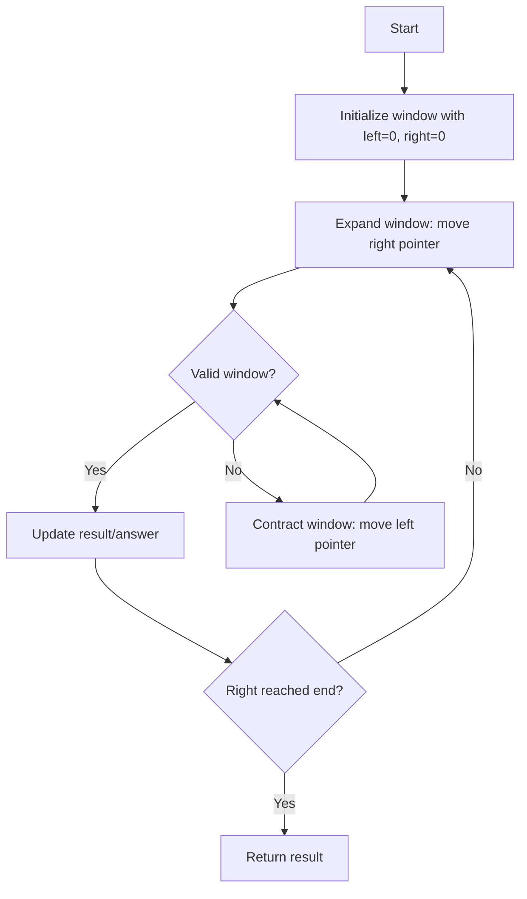
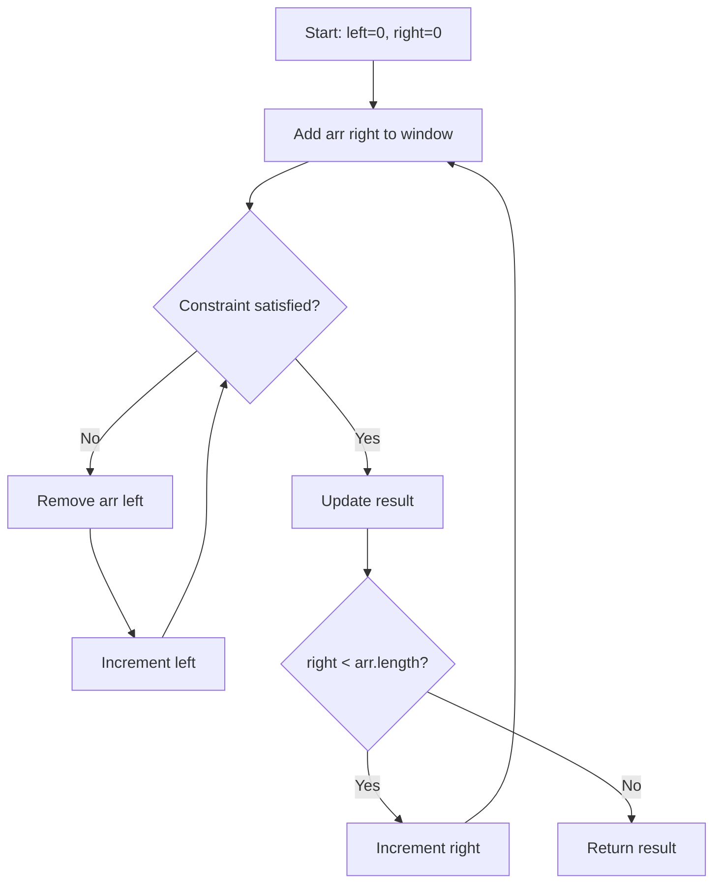

# Sliding Window Technique

## Table of Contents
- [Overview](#overview)
- [When to Use](#when-to-use)
- [Types of Sliding Windows](#types-of-sliding-windows)
- [Fixed-Size Window](#fixed-size-window)
- [Variable-Size Window](#variable-size-window)
- [Pattern Variations](#pattern-variations)
- [Time and Space Complexity](#time-and-space-complexity)
- [Common Pitfalls](#common-pitfalls)
- [Additional Resources](#additional-resources)

## Overview

The **Sliding Window** technique is an algorithmic pattern used to efficiently process sequential data (arrays, strings, linked lists) by maintaining a "window" that moves across the data structure. Instead of recalculating from scratch for each position, we update the window incrementally, leading to significant performance improvements.

The technique transforms problems that would typically require nested loops (O(n²)) into linear time solutions (O(n)).

### Key Concept

Imagine you have a window looking at a portion of an array. Rather than closing the window and opening a new one at the next position, you:
1. **Expand** the window by adding new elements on the right
2. **Contract** the window by removing elements from the left
3. **Track** relevant information about the current window state



## When to Use

The sliding window technique is ideal when you need to:

- ✅ Find subarrays/substrings that satisfy certain conditions
- ✅ Track contiguous sequences of elements
- ✅ Optimize problems involving "longest", "shortest", or "maximum/minimum" subarray questions
- ✅ Process streaming data with constraints
- ✅ Find patterns in sequences (anagrams, palindromes, etc.)

**Common Problem Keywords:**
- "contiguous subarray"
- "substring"
- "longest/shortest sequence"
- "window of size k"
- "at most/at least k distinct elements"

## Types of Sliding Windows

### 1. Fixed-Size Window
The window size remains constant throughout the algorithm.

### 2. Variable-Size Window
The window expands and contracts based on conditions.

## Fixed-Size Window

In a fixed-size window, we maintain a window of constant size `k` and slide it across the array.

### Pattern Template

```javascript
const fixedWindowPattern = (arr, k) => {
    let windowSum = 0;
    let result = 0;
    
    // Initialize the first window
    for (let i = 0; i < k; i++) {
        windowSum += arr[i];
    }
    result = windowSum;
    
    // Slide the window
    for (let i = k; i < arr.length; i++) {
        windowSum = windowSum - arr[i - k] + arr[i]; // Remove left, add right
        result = Math.max(result, windowSum);
    }
    
    return result;
};
```

### Example: Maximum Sum of Subarray of Size K

```javascript
/**
 * Find the maximum sum of any contiguous subarray of size k
 * @param {number[]} nums - Array of numbers
 * @param {number} k - Window size
 * @return {number} Maximum sum
 */
const maxSumSubarray = (nums, k) => {
    if (nums.length < k) return null;
    
    let maxSum = 0;
    let windowSum = 0;
    
    // Calculate sum of first window
    for (let i = 0; i < k; i++) {
        windowSum += nums[i];
    }
    maxSum = windowSum;
    
    // Slide the window and update max
    for (let i = k; i < nums.length; i++) {
        windowSum = windowSum - nums[i - k] + nums[i];
        maxSum = Math.max(maxSum, windowSum);
    }
    
    return maxSum;
};

// Example usage:
console.log(maxSumSubarray([2, 1, 5, 1, 3, 2], 3)); // Output: 9 (5+1+3)
```

### Example: Find All Anagrams (Fixed Window with Frequency Map)

```javascript
/**
 * Find all start indices of p's anagrams in s
 * @param {string} s - Source string
 * @param {string} p - Pattern string
 * @return {number[]} Array of starting indices
 */
const findAnagrams = (s, p) => {
    if (p.length > s.length) return [];
    
    const result = [];
    const pFreq = new Map();
    const windowFreq = new Map();
    
    // Build frequency map for pattern
    for (const char of p) {
        pFreq.set(char, (pFreq.get(char) || 0) + 1);
    }
    
    // Initialize first window
    for (let i = 0; i < p.length; i++) {
        const char = s[i];
        windowFreq.set(char, (windowFreq.get(char) || 0) + 1);
    }
    
    // Helper to check if maps are equal
    const mapsEqual = (map1, map2) => {
        if (map1.size !== map2.size) return false;
        for (const [key, val] of map1) {
            if (map2.get(key) !== val) return false;
        }
        return true;
    };
    
    // Check first window
    if (mapsEqual(pFreq, windowFreq)) result.push(0);
    
    // Slide window
    for (let i = p.length; i < s.length; i++) {
        // Remove leftmost character
        const leftChar = s[i - p.length];
        windowFreq.set(leftChar, windowFreq.get(leftChar) - 1);
        if (windowFreq.get(leftChar) === 0) {
            windowFreq.delete(leftChar);
        }
        
        // Add rightmost character
        const rightChar = s[i];
        windowFreq.set(rightChar, (windowFreq.get(rightChar) || 0) + 1);
        
        // Check if current window is an anagram
        if (mapsEqual(pFreq, windowFreq)) {
            result.push(i - p.length + 1);
        }
    }
    
    return result;
};

// Example usage:
console.log(findAnagrams("cbaebabacd", "abc")); // Output: [0, 6]
```

## Variable-Size Window

In a variable-size window, the window expands and contracts dynamically based on constraints. This typically uses two pointers (left and right).

### Pattern Template

```javascript
const variableWindowPattern = (arr) => {
    let left = 0;
    let result = 0;
    let windowState = {}; // Track window state (sum, set, map, etc.)
    
    for (let right = 0; right < arr.length; right++) {
        // Expand window: add arr[right] to window
        // Update windowState
        
        // Contract window while constraint is violated
        while (/* constraint violated */) {
            // Remove arr[left] from window
            // Update windowState
            left++;
        }
        
        // Update result with current valid window
        result = Math.max(result, right - left + 1);
    }
    
    return result;
};
```

### Flow Diagram



### Example: Longest Substring Without Repeating Characters

```javascript
/**
 * Find length of longest substring without repeating characters
 * @param {string} s - Input string
 * @return {number} Length of longest substring
 */
const lengthOfLongestSubstring = (s) => {
    const charSet = new Set();
    let left = 0;
    let maxLength = 0;
    
    for (let right = 0; right < s.length; right++) {
        // Contract window while we have a duplicate
        while (charSet.has(s[right])) {
            charSet.delete(s[left]);
            left++;
        }
        
        // Add current character to window
        charSet.add(s[right]);
        
        // Update max length
        maxLength = Math.max(maxLength, right - left + 1);
    }
    
    return maxLength;
};

// Example usage:
console.log(lengthOfLongestSubstring("abcabcbb")); // Output: 3 ("abc")
console.log(lengthOfLongestSubstring("bbbbb"));    // Output: 1 ("b")
console.log(lengthOfLongestSubstring("pwwkew"));   // Output: 3 ("wke")
```

### Example: Longest Substring with At Most K Distinct Characters

```javascript
/**
 * Find length of longest substring with at most k distinct characters
 * @param {string} s - Input string
 * @param {number} k - Maximum distinct characters
 * @return {number} Length of longest substring
 */
const lengthOfLongestSubstringKDistinct = (s, k) => {
    if (k === 0) return 0;
    
    const charFreq = new Map();
    let left = 0;
    let maxLength = 0;
    
    for (let right = 0; right < s.length; right++) {
        // Expand window: add character
        const rightChar = s[right];
        charFreq.set(rightChar, (charFreq.get(rightChar) || 0) + 1);
        
        // Contract window while we have too many distinct characters
        while (charFreq.size > k) {
            const leftChar = s[left];
            charFreq.set(leftChar, charFreq.get(leftChar) - 1);
            if (charFreq.get(leftChar) === 0) {
                charFreq.delete(leftChar);
            }
            left++;
        }
        
        // Update max length with current valid window
        maxLength = Math.max(maxLength, right - left + 1);
    }
    
    return maxLength;
};

// Example usage:
console.log(lengthOfLongestSubstringKDistinct("eceba", 2));  // Output: 3 ("ece")
console.log(lengthOfLongestSubstringKDistinct("aa", 1));     // Output: 2 ("aa")
```

### Example: Minimum Window Substring

```javascript
/**
 * Find minimum window in s that contains all characters from t
 * @param {string} s - Source string
 * @param {string} t - Target string with required characters
 * @return {string} Minimum window substring
 */
const minWindow = (s, t) => {
    if (s.length < t.length) return "";
    
    const targetFreq = new Map();
    const windowFreq = new Map();
    
    // Build frequency map for target
    for (const char of t) {
        targetFreq.set(char, (targetFreq.get(char) || 0) + 1);
    }
    
    let left = 0;
    let minLen = Infinity;
    let minStart = 0;
    let matched = 0; // Number of unique characters matched with required frequency
    
    for (let right = 0; right < s.length; right++) {
        const rightChar = s[right];
        
        // Expand window
        if (targetFreq.has(rightChar)) {
            windowFreq.set(rightChar, (windowFreq.get(rightChar) || 0) + 1);
            if (windowFreq.get(rightChar) === targetFreq.get(rightChar)) {
                matched++;
            }
        }
        
        // Contract window while all characters are matched
        while (matched === targetFreq.size) {
            // Update minimum window
            if (right - left + 1 < minLen) {
                minLen = right - left + 1;
                minStart = left;
            }
            
            const leftChar = s[left];
            if (targetFreq.has(leftChar)) {
                if (windowFreq.get(leftChar) === targetFreq.get(leftChar)) {
                    matched--;
                }
                windowFreq.set(leftChar, windowFreq.get(leftChar) - 1);
            }
            left++;
        }
    }
    
    return minLen === Infinity ? "" : s.substring(minStart, minStart + minLen);
};

// Example usage:
console.log(minWindow("ADOBECODEBANC", "ABC")); // Output: "BANC"
console.log(minWindow("a", "a"));               // Output: "a"
console.log(minWindow("a", "aa"));              // Output: ""
```

## Pattern Variations

### Two Pointers with Opposite Directions

Sometimes "sliding window" is combined with two pointers moving from opposite ends:

```javascript
/**
 * Two sum in sorted array using two pointers
 * @param {number[]} numbers - Sorted array
 * @param {number} target - Target sum
 * @return {number[]} Indices of the two numbers
 */
const twoSumSorted = (numbers, target) => {
    let left = 0;
    let right = numbers.length - 1;
    
    while (left < right) {
        const sum = numbers[left] + numbers[right];
        
        if (sum === target) {
            return [left + 1, right + 1]; // 1-indexed
        } else if (sum < target) {
            left++;
        } else {
            right--;
        }
    }
    
    return [];
};
```

### Fast and Slow Pointers

Used for cycle detection and finding middle elements:

```javascript
/**
 * Detect cycle in linked list using fast/slow pointers
 * @param {ListNode} head - Head of linked list
 * @return {boolean} True if cycle exists
 */
const hasCycle = (head) => {
    if (!head || !head.next) return false;
    
    let slow = head;
    let fast = head.next;
    
    while (fast && fast.next) {
        if (slow === fast) return true;
        slow = slow.next;
        fast = fast.next.next;
    }
    
    return false;
};
```

### Window with Running Aggregate

Track cumulative values across the window:

```javascript
/**
 * Find if any subarray sums to target
 * @param {number[]} nums - Array of numbers
 * @param {number} k - Target sum
 * @return {boolean} True if such subarray exists
 */
const subarraySum = (nums, k) => {
    const prefixSum = new Map([[0, 1]]); // sum -> count
    let currentSum = 0;
    let count = 0;
    
    for (const num of nums) {
        currentSum += num;
        
        // Check if (currentSum - k) exists in map
        if (prefixSum.has(currentSum - k)) {
            count += prefixSum.get(currentSum - k);
        }
        
        // Add current sum to map
        prefixSum.set(currentSum, (prefixSum.get(currentSum) || 0) + 1);
    }
    
    return count;
};
```

## Time and Space Complexity

### Time Complexity

**Fixed Window:** O(n)
- Single pass through the array
- Constant time window updates

**Variable Window:** O(n)
- Each element is visited at most twice (once by right pointer, once by left pointer)
- Inner while loop doesn't reset; left pointer only moves forward

### Space Complexity

**Depends on tracking structure:**
- O(1): When tracking primitives (sum, count, min/max)
- O(k): When using Set/Map with at most k distinct elements
- O(n): When worst case requires storing all elements

### Example Analysis

```javascript
// Time: O(n), Space: O(min(n, k)) where k is size of character set
const lengthOfLongestSubstring = (s) => {
    const charSet = new Set(); // Space: O(k) where k ≤ 128 for ASCII
    let left = 0;
    let maxLength = 0;
    
    for (let right = 0; right < s.length; right++) { // O(n) iterations
        while (charSet.has(s[right])) { // Amortized O(1)
            charSet.delete(s[left]);
            left++;
        }
        charSet.add(s[right]);
        maxLength = Math.max(maxLength, right - left + 1);
    }
    
    return maxLength;
};
// Total: Each element added once, removed at most once = O(2n) = O(n)
```

## Common Pitfalls

### 1. Off-by-One Errors

```javascript
// ❌ WRONG: Window size calculation
const windowSize = right - left; // Missing +1

// ✅ CORRECT
const windowSize = right - left + 1;
```

### 2. Not Handling Edge Cases

```javascript
// ❌ WRONG: Doesn't check if k is valid
const maxSumSubarray = (nums, k) => {
    let sum = 0;
    for (let i = 0; i < k; i++) {
        sum += nums[i]; // May access undefined
    }
    // ...
};

// ✅ CORRECT
const maxSumSubarray = (nums, k) => {
    if (nums.length < k || k <= 0) return null;
    // ...
};
```

### 3. Incorrect Window State Updates

```javascript
// ❌ WRONG: Forgot to decrease frequency when removing
while (charMap.size > k) {
    charMap.delete(s[left]); // Should decrease count first
    left++;
}

// ✅ CORRECT
while (charMap.size > k) {
    const leftChar = s[left];
    charMap.set(leftChar, charMap.get(leftChar) - 1);
    if (charMap.get(leftChar) === 0) {
        charMap.delete(leftChar);
    }
    left++;
}
```

### 4. Premature Window Expansion

```javascript
// ❌ WRONG: Moving right pointer in the while loop
while (condition) {
    // ... remove left
    left++;
    right++; // Don't do this!
}

// ✅ CORRECT: Only move right in the for loop
for (let right = 0; right < arr.length; right++) {
    while (condition) {
        // ... remove left
        left++;
    }
}
```

## Additional Resources

### Articles and Tutorials
- [Master the Sliding Window Technique](https://www.geeksforgeeks.org/window-sliding-technique/) - GeeksforGeeks comprehensive guide
- [Two Pointers Technique](https://algodaily.com/lessons/using-the-two-pointer-technique) - AlgoDaily explanation
- [Sliding Window Algorithm Visualized](https://medium.com/outco/how-to-solve-sliding-window-problems-28d67601a66) - Medium article with visual examples

### Video Tutorials
- [Sliding Window Technique - Algorithmic Mental Models](https://www.youtube.com/watch?v=MK-NZ4hN7rs) - YouTube tutorial by Back To Back SWE
- [Two Pointer Technique Explained](https://www.youtube.com/watch?v=On03HWe2tZM) - NeetCode

### Interactive Learning
- [VisuAlgo - Visualizing Algorithms](https://visualgo.net/en/sorting) - Interactive algorithm visualizations
- [Algorithm Visualizer](https://algorithm-visualizer.org/) - Visual representations of algorithms

### Practice Problem Collections
- [14 Patterns to Ace Any Coding Interview](https://hackernoon.com/14-patterns-to-ace-any-coding-interview-question-c5bb3357f6ed) - Includes sliding window section
- [Common Algorithmic Patterns](https://www.educative.io/blog/top-algorithms-to-learn) - Overview of common patterns including sliding window

### Books
- "Cracking the Coding Interview" by Gayle Laakmann McDowell - Chapter on Arrays and Strings
- "Algorithm Design Manual" by Steven Skiena - Section on two-pointer techniques
- "Elements of Programming Interviews" - Problem-solving patterns including sliding window

---

**Pro Tip:** When approaching a sliding window problem, first identify:
1. What am I tracking in the window? (sum, frequency, unique count, etc.)
2. When should I expand the window? (usually: always, with the for loop)
3. When should I contract the window? (when constraint is violated)
4. When should I update my result? (after ensuring window is valid)
