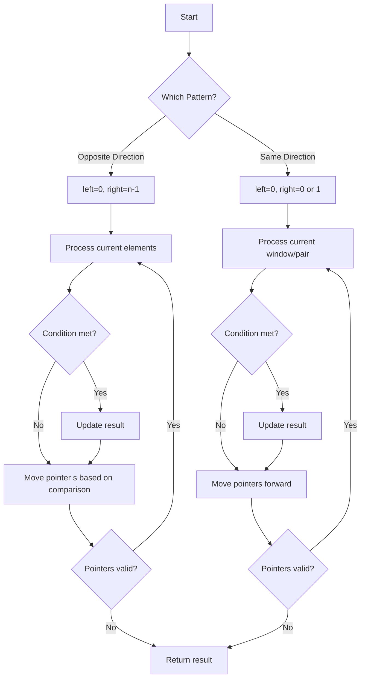
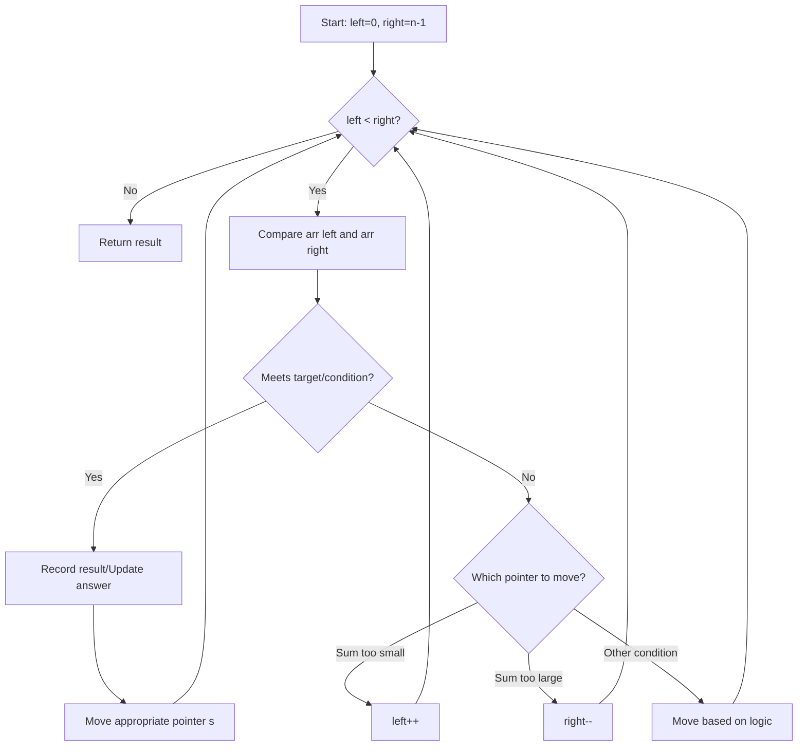
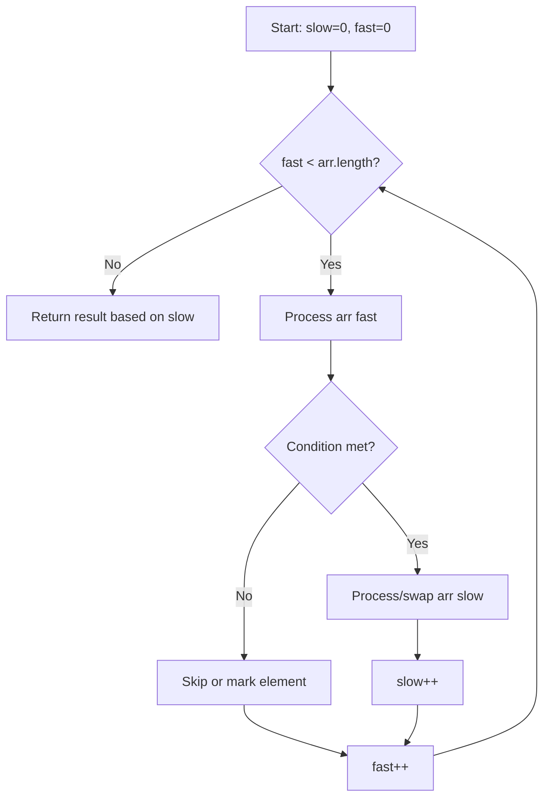

# Two Pointers Technique

## Table of Contents
- [Overview](#overview)
- [When to Use](#when-to-use)
- [Types of Two Pointers](#types-of-two-pointers)
- [Opposite Direction (Convergent) Two Pointers](#opposite-direction-convergent-two-pointers)
- [Same Direction (Parallel) Two Pointers](#same-direction-parallel-two-pointers)
- [Pattern Variations](#pattern-variations)
- [Time and Space Complexity](#time-and-space-complexity)
- [Common Pitfalls](#common-pitfalls)
- [Additional Resources](#additional-resources)

## Overview

The **Two Pointers** technique is a fundamental algorithmic pattern that uses two pointers (or indices) to traverse a data structure, typically an array or string. By strategically moving these pointers based on certain conditions, we can solve problems more efficiently than with nested loops.

The technique transforms problems that would typically require O(n²) time complexity into O(n) solutions by intelligently moving pointers to eliminate unnecessary comparisons.

### Key Concept

Instead of checking every possible pair or combination of elements (which would require nested loops), we use two pointers that move in coordinated ways based on the problem constraints:
1. **Initialize** pointers at strategic positions (both ends, same start, etc.)
2. **Move** pointers based on comparisons or conditions
3. **Process** elements at pointer positions
4. **Terminate** when pointers meet or cross



## When to Use

The two pointers technique is ideal when you need to:

- ✅ Search for pairs or triplets with specific properties in sorted arrays
- ✅ Remove duplicates or unwanted elements in-place
- ✅ Reverse or rearrange elements
- ✅ Find palindromes or symmetric patterns
- ✅ Partition arrays based on conditions
- ✅ Merge sorted arrays or lists
- ✅ Optimize nested loop problems with ordered data

**Common Problem Keywords:**
- "sorted array"
- "pairs/triplets that sum to target"
- "remove duplicates in-place"
- "reverse" or "palindrome"
- "partition" or "rearrange"
- "two sum" variations
- "merge" sorted structures

**Key Indicators:**
- Input array is sorted (or can be sorted)
- Problem asks about pairs, triplets, or subarrays
- Need to compare elements from different positions
- In-place modification required
- Looking for symmetry or matching elements

## Types of Two Pointers

### 1. Opposite Direction (Convergent)
Pointers start at opposite ends and move toward each other until they meet.

**Common Uses:**
- Two sum in sorted array
- Container with most water
- Valid palindrome
- Trapping rain water

### 2. Same Direction (Parallel)
Both pointers start at the same end and move in the same direction, usually at different speeds.

**Common Uses:**
- Remove duplicates from sorted array
- Move zeroes to end
- Fast and slow pointer (cycle detection)
- Sliding window variations

## Opposite Direction (Convergent) Two Pointers

In this pattern, one pointer starts at the beginning (left) and another at the end (right), moving toward each other based on conditions.

### Pattern Template

```javascript
const oppositeDirectionPattern = (arr) => {
    let left = 0;
    let right = arr.length - 1;
    
    while (left < right) {
        // Process or compare arr[left] and arr[right]
        
        if (/* condition to move left */) {
            left++;
        } else if (/* condition to move right */) {
            right--;
        } else {
            // Found solution or need to move both
            left++;
            right--;
        }
    }
    
    return result;
};
```

### Flow Diagram



### Example 1: Two Sum II (Sorted Array)

```javascript
/**
 * Find two numbers that add up to target in a sorted array
 * @param {number[]} numbers - Sorted array in ascending order
 * @param {number} target - Target sum
 * @return {number[]} Indices of the two numbers (1-indexed)
 */
const twoSum = (numbers, target) => {
    let left = 0;
    let right = numbers.length - 1;
    
    while (left < right) {
        const sum = numbers[left] + numbers[right];
        
        if (sum === target) {
            return [left + 1, right + 1]; // 1-indexed
        } else if (sum < target) {
            // Sum is too small, need larger number
            left++;
        } else {
            // Sum is too large, need smaller number
            right--;
        }
    }
    
    return []; // No solution found
};

// Example usage:
console.log(twoSum([2, 7, 11, 15], 9));    // Output: [1, 2]
console.log(twoSum([2, 3, 4], 6));          // Output: [1, 3]
console.log(twoSum([-1, 0], -1));           // Output: [1, 2]
```

**Why This Works:**
- Array is sorted in ascending order
- If sum is too small, we need a larger number → move left pointer right
- If sum is too large, we need a smaller number → move right pointer left
- Each comparison eliminates one possible pair, giving us O(n) time

### Example 2: Valid Palindrome

```javascript
/**
 * Check if string is a valid palindrome (alphanumeric chars only, case-insensitive)
 * @param {string} s - Input string
 * @return {boolean} True if palindrome
 */
const isPalindrome = (s) => {
    // Helper to check if character is alphanumeric
    const isAlphanumeric = (char) => {
        return /[a-zA-Z0-9]/.test(char);
    };
    
    let left = 0;
    let right = s.length - 1;
    
    while (left < right) {
        // Skip non-alphanumeric characters from left
        while (left < right && !isAlphanumeric(s[left])) {
            left++;
        }
        
        // Skip non-alphanumeric characters from right
        while (left < right && !isAlphanumeric(s[right])) {
            right--;
        }
        
        // Compare characters (case-insensitive)
        if (s[left].toLowerCase() !== s[right].toLowerCase()) {
            return false;
        }
        
        left++;
        right--;
    }
    
    return true;
};

// Example usage:
console.log(isPalindrome("A man, a plan, a canal: Panama")); // Output: true
console.log(isPalindrome("race a car"));                      // Output: false
console.log(isPalindrome(" "));                               // Output: true
```

### Example 3: Container With Most Water

```javascript
/**
 * Find two lines that together with x-axis form container with most water
 * @param {number[]} height - Array where height[i] is height of line i
 * @return {number} Maximum area of water container can hold
 */
const maxArea = (height) => {
    let left = 0;
    let right = height.length - 1;
    let maxWater = 0;
    
    while (left < right) {
        // Calculate current area
        const width = right - left;
        const currentHeight = Math.min(height[left], height[right]);
        const currentArea = width * currentHeight;
        
        maxWater = Math.max(maxWater, currentArea);
        
        // Move the pointer with smaller height
        // (moving the larger height won't increase area)
        if (height[left] < height[right]) {
            left++;
        } else {
            right--;
        }
    }
    
    return maxWater;
};

// Example usage:
console.log(maxArea([1, 8, 6, 2, 5, 4, 8, 3, 7])); // Output: 49
console.log(maxArea([1, 1]));                       // Output: 1
```

**Greedy Strategy:**
- Start with maximum width (pointers at ends)
- Area is limited by the shorter line
- Moving the shorter line pointer might find a taller line
- Moving the taller line pointer can only decrease area (width decreases, height can't increase)

### Example 4: 3Sum (Finding Triplets)

```javascript
/**
 * Find all unique triplets that sum to zero
 * @param {number[]} nums - Array of integers
 * @return {number[][]} Array of triplets [a, b, c] where a + b + c = 0
 */
const threeSum = (nums) => {
    const result = [];
    nums.sort((a, b) => a - b); // Sort array first
    
    for (let i = 0; i < nums.length - 2; i++) {
        // Skip duplicates for first number
        if (i > 0 && nums[i] === nums[i - 1]) continue;
        
        // Use two pointers for remaining two numbers
        let left = i + 1;
        let right = nums.length - 1;
        const target = -nums[i]; // We want nums[left] + nums[right] = -nums[i]
        
        while (left < right) {
            const sum = nums[left] + nums[right];
            
            if (sum === target) {
                result.push([nums[i], nums[left], nums[right]]);
                
                // Skip duplicates for second number
                while (left < right && nums[left] === nums[left + 1]) {
                    left++;
                }
                // Skip duplicates for third number
                while (left < right && nums[right] === nums[right - 1]) {
                    right--;
                }
                
                left++;
                right--;
            } else if (sum < target) {
                left++;
            } else {
                right--;
            }
        }
    }
    
    return result;
};

// Example usage:
console.log(threeSum([-1, 0, 1, 2, -1, -4])); // Output: [[-1, -1, 2], [-1, 0, 1]]
console.log(threeSum([0, 1, 1]));              // Output: []
console.log(threeSum([0, 0, 0]));              // Output: [[0, 0, 0]]
```

## Same Direction (Parallel) Two Pointers

In this pattern, both pointers start at the same position (usually the beginning) and move forward, often at different speeds or under different conditions.

### Pattern Template

```javascript
const sameDirectionPattern = (arr) => {
    let slow = 0;
    let fast = 0;
    
    while (fast < arr.length) {
        // Process arr[fast]
        
        if (/* condition met */) {
            // Process arr[slow] or move slow
            slow++;
        }
        
        fast++;
    }
    
    return slow; // or other result
};
```

### Flow Diagram



### Example 1: Remove Duplicates from Sorted Array

```javascript
/**
 * Remove duplicates in-place from sorted array
 * Returns length of array with unique elements
 * @param {number[]} nums - Sorted array
 * @return {number} Length of unique elements
 */
const removeDuplicates = (nums) => {
    if (nums.length === 0) return 0;
    
    let slow = 0; // Points to last unique element
    
    for (let fast = 1; fast < nums.length; fast++) {
        // Found a new unique element
        if (nums[fast] !== nums[slow]) {
            slow++;
            nums[slow] = nums[fast]; // Place it after last unique
        }
    }
    
    return slow + 1; // Length is index + 1
};

// Example usage:
const nums1 = [1, 1, 2];
console.log(removeDuplicates(nums1)); // Output: 2, nums1 = [1, 2, _]

const nums2 = [0, 0, 1, 1, 1, 2, 2, 3, 3, 4];
console.log(removeDuplicates(nums2)); // Output: 5, nums2 = [0, 1, 2, 3, 4, _, _, _, _, _]
```

**How It Works:**
- `slow`: tracks position of last unique element
- `fast`: explores array to find next unique element
- When `nums[fast] !== nums[slow]`, we found a new unique value
- Place it at `slow + 1` and increment `slow`

### Example 2: Move Zeroes

```javascript
/**
 * Move all zeros to end while maintaining relative order of non-zeros
 * @param {number[]} nums - Array to modify in-place
 * @return {void} Modifies nums in-place
 */
const moveZeroes = (nums) => {
    let slow = 0; // Points to position for next non-zero
    
    // Move all non-zeros to front
    for (let fast = 0; fast < nums.length; fast++) {
        if (nums[fast] !== 0) {
            nums[slow] = nums[fast];
            slow++;
        }
    }
    
    // Fill remaining positions with zeros
    for (let i = slow; i < nums.length; i++) {
        nums[i] = 0;
    }
};

// Alternative: Swap instead of overwrite
const moveZeroesSwap = (nums) => {
    let slow = 0; // Position for next non-zero
    
    for (let fast = 0; fast < nums.length; fast++) {
        if (nums[fast] !== 0) {
            // Swap non-zero with position at slow
            [nums[slow], nums[fast]] = [nums[fast], nums[slow]];
            slow++;
        }
    }
};

// Example usage:
const nums = [0, 1, 0, 3, 12];
moveZeroes(nums);
console.log(nums); // Output: [1, 3, 12, 0, 0]
```

### Example 3: Remove Element

```javascript
/**
 * Remove all instances of val in-place
 * @param {number[]} nums - Array to modify
 * @param {number} val - Value to remove
 * @return {number} New length of array
 */
const removeElement = (nums, val) => {
    let slow = 0; // Position for next element to keep
    
    for (let fast = 0; fast < nums.length; fast++) {
        if (nums[fast] !== val) {
            nums[slow] = nums[fast];
            slow++;
        }
    }
    
    return slow;
};

// Example usage:
const nums1 = [3, 2, 2, 3];
console.log(removeElement(nums1, 3)); // Output: 2, nums1 = [2, 2, _, _]

const nums2 = [0, 1, 2, 2, 3, 0, 4, 2];
console.log(removeElement(nums2, 2)); // Output: 5, nums2 = [0, 1, 3, 0, 4, _, _, _]
```

### Example 4: Partition Array

```javascript
/**
 * Partition array so all elements < x come before elements >= x
 * @param {number[]} nums - Array to partition
 * @param {number} x - Partition value
 * @return {void} Modifies nums in-place
 */
const partition = (nums, x) => {
    let slow = 0; // Position for next element < x
    
    // First pass: move all elements < x to front
    for (let fast = 0; fast < nums.length; fast++) {
        if (nums[fast] < x) {
            [nums[slow], nums[fast]] = [nums[fast], nums[slow]];
            slow++;
        }
    }
    
    return slow; // Index where partition occurs
};

// Example usage:
const nums = [1, 4, 3, 2, 5, 2];
const partitionIndex = partition(nums, 3);
console.log(nums);          // Output: [1, 2, 2, 4, 5, 3] (order may vary)
console.log(partitionIndex); // Output: 3
```

## Pattern Variations

### Fast and Slow Pointers (Floyd's Cycle Detection)

A special case where pointers move at different speeds, commonly used in linked lists.

```javascript
/**
 * Detect if linked list has a cycle using fast and slow pointers
 * @param {ListNode} head - Head of linked list
 * @return {boolean} True if cycle exists
 */
const hasCycle = (head) => {
    if (!head || !head.next) return false;
    
    let slow = head;
    let fast = head;
    
    while (fast && fast.next) {
        slow = slow.next;       // Move 1 step
        fast = fast.next.next;  // Move 2 steps
        
        if (slow === fast) {
            return true; // Cycle detected
        }
    }
    
    return false; // Reached end, no cycle
};
```

**Why This Works:**
- If there's a cycle, fast pointer will eventually catch up to slow pointer
- Like runners on a circular track - faster runner will lap slower runner
- If no cycle, fast pointer reaches end first

### Finding Cycle Start

```javascript
/**
 * Find node where cycle begins (if exists)
 * @param {ListNode} head - Head of linked list
 * @return {ListNode} Node where cycle begins, or null
 */
const detectCycle = (head) => {
    if (!head || !head.next) return null;
    
    let slow = head;
    let fast = head;
    let hasCycle = false;
    
    // Phase 1: Detect if cycle exists
    while (fast && fast.next) {
        slow = slow.next;
        fast = fast.next.next;
        
        if (slow === fast) {
            hasCycle = true;
            break;
        }
    }
    
    if (!hasCycle) return null;
    
    // Phase 2: Find cycle start
    // Reset one pointer to head, move both at same speed
    slow = head;
    while (slow !== fast) {
        slow = slow.next;
        fast = fast.next;
    }
    
    return slow; // This is the start of cycle
};
```

### Finding Middle of Linked List

```javascript
/**
 * Find middle node of linked list
 * @param {ListNode} head - Head of linked list
 * @return {ListNode} Middle node (second middle if even length)
 */
const middleNode = (head) => {
    let slow = head;
    let fast = head;
    
    while (fast && fast.next) {
        slow = slow.next;
        fast = fast.next.next;
    }
    
    return slow; // Slow is at middle when fast reaches end
};
```

### Reverse String/Array In-Place

```javascript
/**
 * Reverse string in-place using two pointers
 * @param {character[]} s - Array of characters
 * @return {void} Modifies s in-place
 */
const reverseString = (s) => {
    let left = 0;
    let right = s.length - 1;
    
    while (left < right) {
        // Swap characters
        [s[left], s[right]] = [s[right], s[left]];
        left++;
        right--;
    }
};

// Example usage:
const chars = ['h', 'e', 'l', 'l', 'o'];
reverseString(chars);
console.log(chars); // Output: ['o', 'l', 'l', 'e', 'h']
```

### Sort Colors (Dutch National Flag)

```javascript
/**
 * Sort array with 0s, 1s, and 2s using three pointers
 * @param {number[]} nums - Array containing only 0, 1, 2
 * @return {void} Modifies nums in-place
 */
const sortColors = (nums) => {
    let low = 0;      // Boundary for 0s
    let mid = 0;      // Current element
    let high = nums.length - 1; // Boundary for 2s
    
    while (mid <= high) {
        if (nums[mid] === 0) {
            [nums[low], nums[mid]] = [nums[mid], nums[low]];
            low++;
            mid++;
        } else if (nums[mid] === 1) {
            mid++;
        } else { // nums[mid] === 2
            [nums[mid], nums[high]] = [nums[high], nums[mid]];
            high--;
            // Don't increment mid - need to check swapped element
        }
    }
};

// Example usage:
const colors = [2, 0, 2, 1, 1, 0];
sortColors(colors);
console.log(colors); // Output: [0, 0, 1, 1, 2, 2]
```

## Time and Space Complexity

### Time Complexity

**Opposite Direction:** O(n)
- Each pointer moves at most n positions
- Total movements: at most n from each pointer
- No nested loops (pointers move toward each other)

**Same Direction:** O(n)
- Fast pointer traverses array once: O(n)
- Slow pointer moves at most n positions: O(n)
- Total: O(n)

**With Sorting:** O(n log n)
- When problem requires sorted input (like 3Sum)
- Sorting: O(n log n)
- Two pointers: O(n)
- Total: O(n log n) - sorting dominates

### Space Complexity

**In-Place Modification:** O(1)
- Only using pointer variables
- No additional data structures
- Modifying input array directly

**With Extra Storage:** O(k)
- When storing results (like triplets in 3Sum)
- k = size of output
- Still O(1) auxiliary space for algorithm itself

### Example Analysis

```javascript
// Time: O(n), Space: O(1)
const isPalindrome = (s) => {
    let left = 0;              // O(1) space
    let right = s.length - 1;  // O(1) space
    
    while (left < right) {     // O(n/2) = O(n) iterations
        // Skip non-alphanumeric: O(1) per skip, O(n) worst case total
        while (left < right && !isAlphanumeric(s[left])) left++;
        while (left < right && !isAlphanumeric(s[right])) right--;
        
        if (s[left].toLowerCase() !== s[right].toLowerCase()) {
            return false;       // O(1) comparison
        }
        left++;
        right--;
    }
    return true;
};
// Each character examined at most once: O(n)
// Constant extra space: O(1)
```

## Common Pitfalls

### 1. Off-by-One Errors

```javascript
// ❌ WRONG: Missing the last valid comparison
while (left < right - 1) { // Should be left < right
    // ...
}

// ❌ WRONG: Infinite loop when not moving pointers
while (left < right) {
    if (condition) {
        // Forgot to move pointer!
    }
}

// ✅ CORRECT
while (left < right) {
    if (condition) {
        left++;  // or right--
    } else {
        right--; // or left++
    }
}
```

### 2. Not Handling Edge Cases

```javascript
// ❌ WRONG: Doesn't check for empty or single element
const twoSum = (nums, target) => {
    let left = 0;
    let right = nums.length - 1;
    // What if nums.length < 2?
};

// ✅ CORRECT
const twoSum = (nums, target) => {
    if (nums.length < 2) return [];
    
    let left = 0;
    let right = nums.length - 1;
    // ...
};
```

### 3. Incorrect Pointer Movement Logic

```javascript
// ❌ WRONG: Moving both pointers when only one should move
if (sum < target) {
    left++;
    right--; // Don't move both!
}

// ✅ CORRECT: Move only the appropriate pointer
if (sum < target) {
    left++;  // Need larger sum
} else if (sum > target) {
    right--; // Need smaller sum
} else {
    return [left, right]; // Found it
}
```

### 4. Forgetting to Skip Duplicates

```javascript
// ❌ WRONG: Will include duplicate triplets
const threeSum = (nums) => {
    nums.sort((a, b) => a - b);
    const result = [];
    
    for (let i = 0; i < nums.length - 2; i++) {
        // Should skip if nums[i] === nums[i-1]
        let left = i + 1;
        let right = nums.length - 1;
        // ...
    }
};

// ✅ CORRECT: Skip duplicates at all levels
const threeSum = (nums) => {
    nums.sort((a, b) => a - b);
    const result = [];
    
    for (let i = 0; i < nums.length - 2; i++) {
        if (i > 0 && nums[i] === nums[i - 1]) continue; // Skip duplicate first number
        
        let left = i + 1;
        let right = nums.length - 1;
        
        while (left < right) {
            const sum = nums[i] + nums[left] + nums[right];
            
            if (sum === 0) {
                result.push([nums[i], nums[left], nums[right]]);
                
                // Skip duplicate second number
                while (left < right && nums[left] === nums[left + 1]) left++;
                // Skip duplicate third number
                while (left < right && nums[right] === nums[right - 1]) right--;
                
                left++;
                right--;
            } else if (sum < 0) {
                left++;
            } else {
                right--;
            }
        }
    }
    return result;
};
```

### 5. Wrong Initialization Positions

```javascript
// ❌ WRONG: Same direction but starting at wrong positions
const removeDuplicates = (nums) => {
    let slow = 1;  // Should start at 0
    let fast = 1;  // This is correct
    // ...
};

// ✅ CORRECT
const removeDuplicates = (nums) => {
    if (nums.length === 0) return 0;
    
    let slow = 0;  // Last unique element
    let fast = 1;  // Exploring for next unique
    // ...
};
```

### 6. Not Considering Sorted vs Unsorted

```javascript
// ❌ WRONG: Using two pointers on unsorted array for sum problems
const twoSum = (nums, target) => {
    // Two pointers only work if array is sorted!
    let left = 0;
    let right = nums.length - 1;
    // This will give wrong results if nums is not sorted
};

// ✅ CORRECT: Either sort first or use hash map
const twoSum = (nums, target) => {
    // Option 1: Sort first (changes indices)
    nums.sort((a, b) => a - b);
    // Then use two pointers
    
    // Option 2: Use hash map instead (better for unsorted)
    const map = new Map();
    for (let i = 0; i < nums.length; i++) {
        const complement = target - nums[i];
        if (map.has(complement)) {
            return [map.get(complement), i];
        }
        map.set(nums[i], i);
    }
};
```

## Additional Resources

### Articles and Tutorials
- [Two Pointers Technique](https://www.geeksforgeeks.org/two-pointers-technique/) - GeeksforGeeks comprehensive guide
- [Master the Two Pointers Pattern](https://medium.com/swlh/two-pointer-technique-solving-array-problems-at-light-speed-56a77ee83d16) - Medium article with examples
- [Two Pointer Algorithm Patterns](https://emre.me/coding-patterns/two-pointers/) - Detailed pattern analysis
- [Fast and Slow Pointers](https://www.educative.io/courses/grokking-the-coding-interview/N7rwVyAZl6D) - Cycle detection deep dive

### Video Tutorials
- [Two Pointers Technique Explained](https://www.youtube.com/watch?v=On03HWe2tZM) - NeetCode
- [Fast and Slow Pointers for Beginners](https://www.youtube.com/watch?v=gBTe7lFR3vc) - Coding Interview tutorial
- [Two Pointers Pattern](https://www.youtube.com/watch?v=Dor7cXc8mc0) - Back To Back SWE

### Interactive Learning
- [VisuAlgo - Linked List Visualization](https://visualgo.net/en/list) - Visualize fast/slow pointers
- [Algorithm Visualizer - Two Pointers](https://algorithm-visualizer.org/) - Interactive examples

### Practice Problem Collections

**Opposite Direction:**
- Two Sum II (LeetCode 167) - Classic example
- 3Sum (LeetCode 15) - Combining with loop
- Container With Most Water (LeetCode 11) - Greedy approach
- Valid Palindrome (LeetCode 125) - String processing
- Trapping Rain Water (LeetCode 42) - Advanced

**Same Direction:**
- Remove Duplicates from Sorted Array (LeetCode 26) - Basic pattern
- Move Zeroes (LeetCode 283) - In-place modification
- Remove Element (LeetCode 27) - Filtering
- Squares of Sorted Array (LeetCode 977) - Merge-like pattern
- Sort Colors (LeetCode 75) - Three pointers

**Fast and Slow:**
- Linked List Cycle (LeetCode 141) - Cycle detection
- Linked List Cycle II (LeetCode 142) - Find cycle start
- Happy Number (LeetCode 202) - Cycle in sequence
- Find Duplicate Number (LeetCode 287) - Array as linked list
- Middle of Linked List (LeetCode 876) - Finding middle

### Books
- "Cracking the Coding Interview" by Gayle Laakmann McDowell - Chapter on Arrays and Strings
- "Algorithm Design Manual" by Steven Skiena - Two-pointer techniques section
- "Elements of Programming Interviews" - Array and string problems
- "Grokking the Coding Interview" - Dedicated two pointers pattern chapter

### Pattern Recognition Guide

**Use Opposite Direction When:**
- ✅ Array is sorted or can be sorted
- ✅ Looking for pairs/triplets with target sum
- ✅ Finding palindromes or symmetric patterns
- ✅ Optimizing area/distance calculations
- ✅ Partitioning around pivot

**Use Same Direction When:**
- ✅ Removing/filtering elements in-place
- ✅ Partitioning array by condition
- ✅ Maintaining relative order
- ✅ Processing with different speeds
- ✅ Sliding window variations

**Use Fast/Slow When:**
- ✅ Linked list problems
- ✅ Cycle detection needed
- ✅ Finding middle element
- ✅ Pattern recognition in sequences
- ✅ Array treated as implicit linked list

---

**Pro Tips:**
1. **Sorted Input**: If problem mentions sorted array and pairs/triplets, think two pointers
2. **In-Place Requirement**: Same direction pointers often best for in-place modifications
3. **Visualization**: Draw out pointer movement for first few steps to verify logic
4. **Pointer Movement**: Always ensure at least one pointer moves in each iteration to avoid infinite loops
5. **Edge Cases**: Test with empty arrays, single elements, all duplicates, and already-sorted inputs
6. **Space Optimization**: Two pointers can often replace O(n) space solutions with O(1) space
